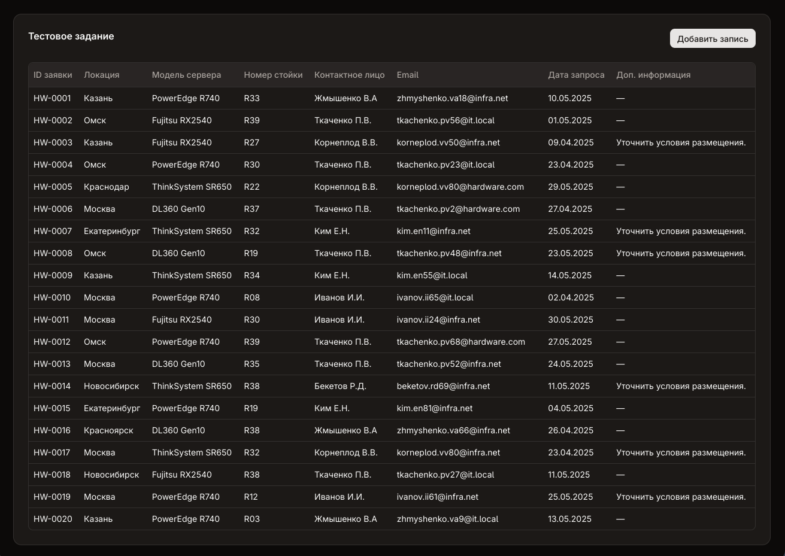
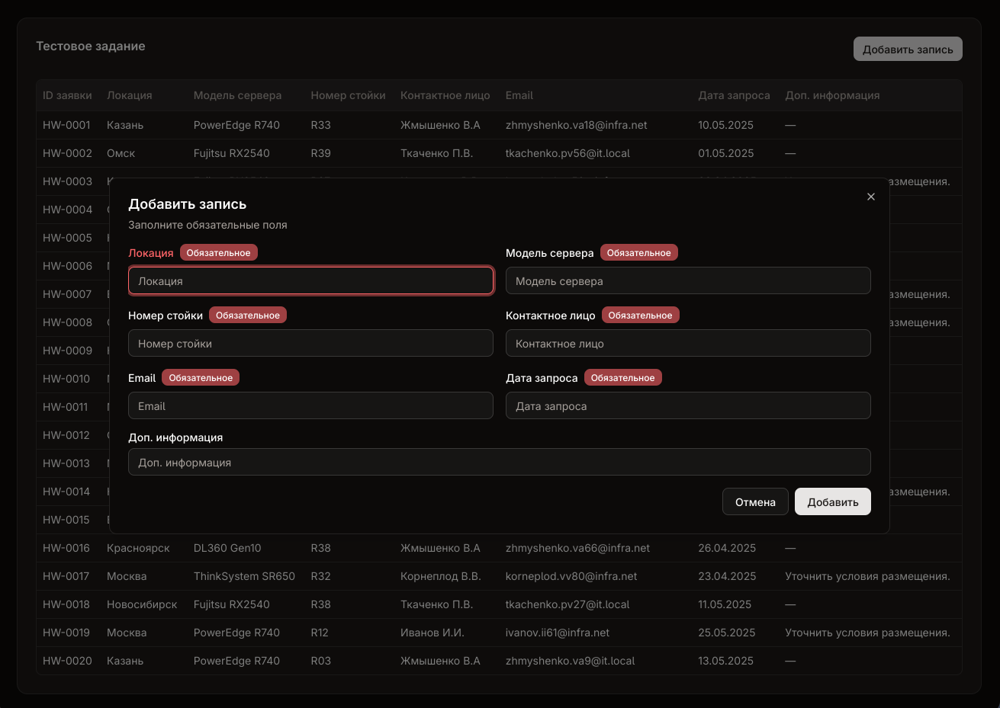

# Тестовое задание – VK Frontend

Небольшое приложение на **React + TypeScript**, реализующее таблицу с ленивой подгрузкой и формой создания записи.

## Описание

Приложение позволяет:

- Отображать таблицу с произвольным числом колонок (5–15)
- Загружать данные с сервера и подгружать их лениво при прокрутке (infinite scroll)
- Создавать новую запись через форму с валидацией
- Динамически подстраиваться под `meta`-схему из API (типы, ограничения, обязательность полей)
- Отправлять форму на сервер и обновлять таблицу без перезагрузки

## Стек

- **React**
- **Vite**
- **Vitest**
- **TypeScript** 
- **react-hook-form + zod**
- **@tanstack/react-query** 
- **shadcn/ui + TailwindCSS** 
- **json-server** 

## Почему нет стейт-менеджера

Cтейт-менеджер не используется, так как он здесь просто не пригодился, достаточно функционала **React Query**. Обновление данных в таблице при добавлении новой записи происходит через `queryClient.invalidateQueries({ queryKey: ["data"] })`

## Запуск проекта

1. Установить зависимости:

```bash
npm install
```

2. Запустить `json-server`:

```bash
npx json-server db.json
```

3. Запустить фронтенд:

```bash
npm run dev
```

## Тесты

Покрыт компонент `AddRecord`:

- Проверка валидации полей
- Проверка сетевого запроса и обновления данных

## Скриншоты


